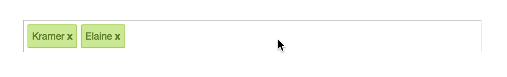

# vue-input-tag
> A Vue.js 2.0 input tag component inspired in [react-tagsinput](https://github.com/olahol/react-tagsinput)

[](https://app.codeship.com/projects/328055)
[](https://coveralls.io/github/matiastucci/vue-input-tag?branch=master)
[](https://www.npmjs.com/package/vue-input-tag)
[](https://www.npmjs.com/package/vue-input-tag)
[](https://www.npmjs.com/package/vue-input-tag)

<p align="center">
  
</p>

## Installation

#### NPM / Yarn

```bash
npm install vue-input-tag --save
```

```bash
yarn add vue-input-tag
```

Then you need to import and register it:

```js
import InputTag from 'vue-input-tag'
```

```js
Vue.component('input-tag', InputTag)
```

#### CDN

```html
<script src="https://unpkg.com/vue"></script>
<script src="https://unpkg.com/vue-input-tag"></script>
```

Then you need to register it:

`Vue.component('input-tag', vueInputTag.default)`

## Usage

```html
<input-tag v-model="tags"></input-tag>
```

## Props
| Name | Type | Default | Description |
| ---:| --- | ---| --- |
| value | Array | [] | Tags to be render in the input |
| placeholder | String | "" | Placeholder to be shown when no tags |
| read-only | Boolean | false | Set input to readonly |
| add-tag-on-blur | Boolean | false | Add tag on input blur |
| limit | String or Number | -1 (none) | Set a limit for the amount of tags |
| validate | String or Function (allows async) or Object | "" | Apply certain validator for user input. Choose from `email`, `url`, `text`, `digits` or `isodate`. Or pass a `function` or a `RegExp` object for custom validation |
| add-tag-on-keys | Array | [ 13 (return), 188 (comma), 9 (tab) ] | Keys that are going to add the new tag
| allow-duplicates | Boolean | false | Allow duplicate tags
| before-adding | Function | null | Function (allows async) to normalize tag before adding. E.g `(tag) => tag.toUpperCase()`

## Events
| Name | Arguments | Description |
| ---: | --- | --- |
| input | Array with tags | Emitted when a tag is added (after successful validation) and when a tag is removed |
| update:tags | Array with tags | Same as input event |
